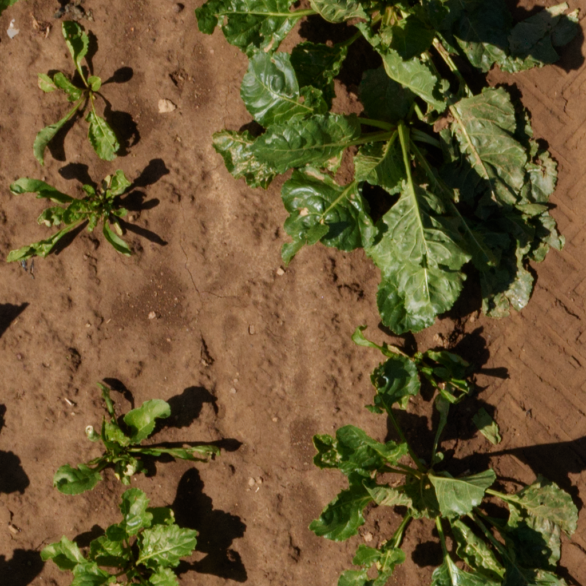
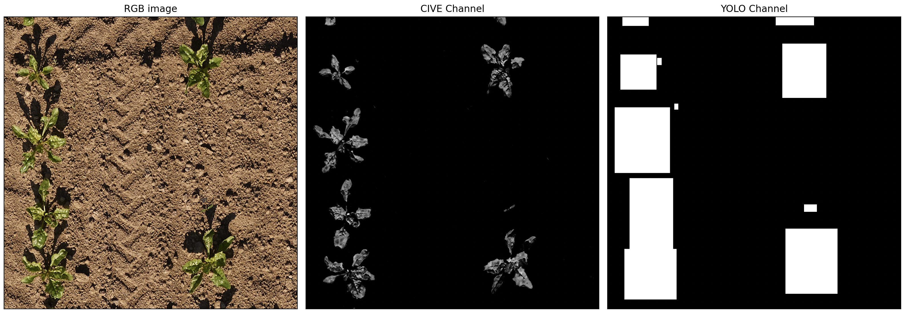
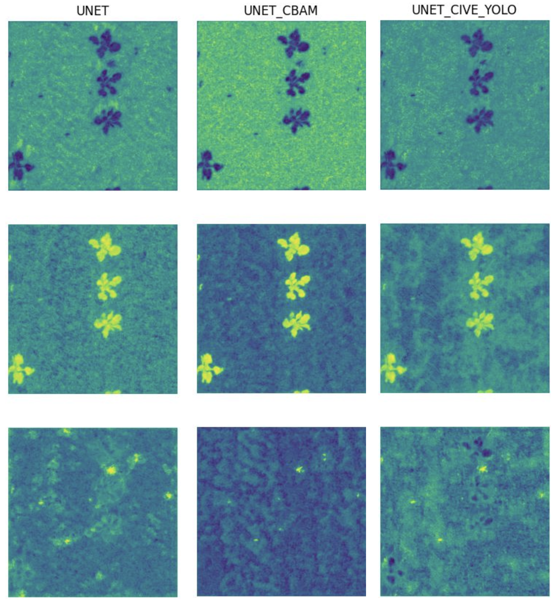

In my final semester at CU Boulder, I took Deep Learning and Neural Networks (CSCI 5922), a graduate-level class covering state-of-the-art deep learning techniques and research. As part of this class, we were required to propose and develop an original deep learning research project on a topic that interested us.

Because of our shared interest in agricultural robotics, my partner and I chose to enter the [PhenoBench Competition](https://www.phenobench.org/benchmarks.html), aimed at improving semantic segmentation (and other tasks) on sugar beet fields. We aimed to improve on the existing submissions by training two different models.

|  |
|:--:|
| *An example frame from the PhenoBench competition. Our aim was to classify each pixel as soil, crop, or weed* |

We based our models on a vanilla UNET architecture, and used this architecture as a control to determine whether our modifications made improvements.

Our first model took a feature engineering approach, by adding two additional channels to the original RGB image before feeding it into the UNET. The first channel was a CIVE (color index of vegetation extraction) image, a common way of detecting vegetation in remote sensing applications. The second channel was a bounding-box mask output by YOLO, a popular object detection network. The idea behind this approach was that it could focus the network's efforts early on regions deemed likely to be vegetation.

|  |
|:--:|
| *The RGB Image, CIVE Channel, and YOLO Channel fed into the UNET in our first model* |

Our second model integrated Convolutional Block Attention Modules (CBAM), which is a module that leverages channel and spatial attention to inform the model of the importance of the output channels. These modules were integrated after max-pooling steps and before up-convolution steps.

We found that the feature engineering approach led to a small improvement in weed detection, but that the CBAM approach led to a significant improvement in weed detection and overall mIoU. We submitted the results to the PhenoBench competition. For more details, please see the report linked above.

|  |
|:--:|
| *Activation maps for each model for soil, crops, and weeds, respectively* |

This project was a nice introduction to deep learning, and I learned a lot about conducting a research project and how to work on an intensive software project with a partner. It also served to deepen my interest in agricultural robotics!
