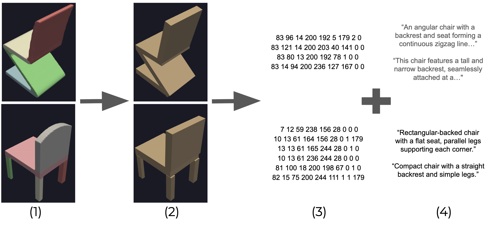
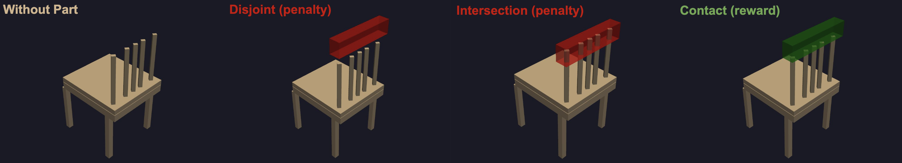
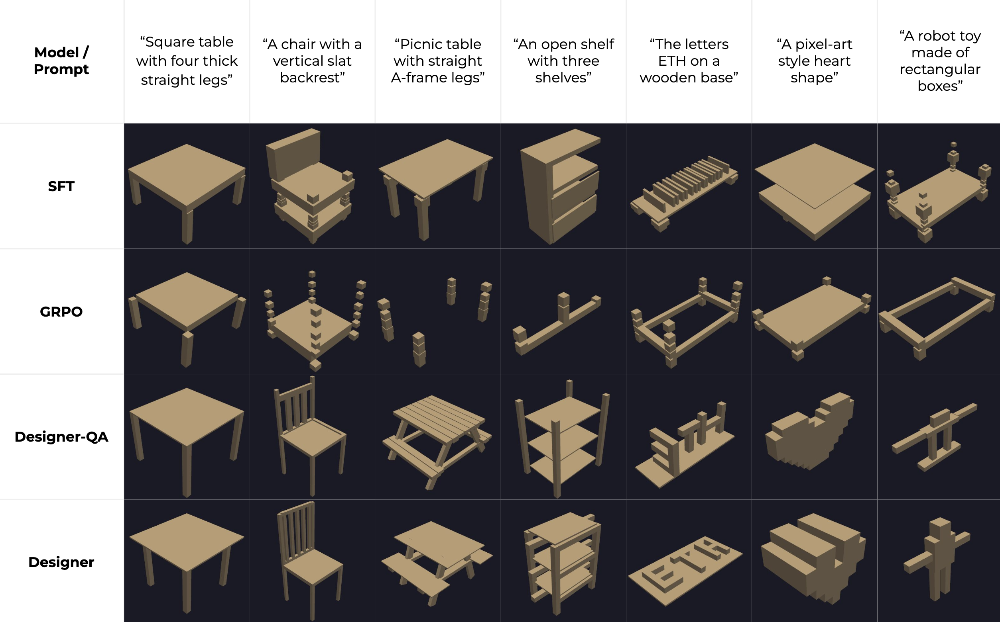

For my semester project at ETH, I joined the [IDEAL lab](https://ideal.ethz.ch) to take on a project in generative AI. The lab was developing a pipeline that would go from text description to a physical wood prototype completely automatically. The assembly stage would take place with a two-armed robot, equipped with a screwdriver and a gripper. My role in the project was to go from text to a 3D assembleable model.

The initial strategy I adopted involved using Supervised Fine-Tuning (SFT) and reinforcement learning to adapt open-weights foundation models to our task. This involved building a dataset, tuning a 1B-parameter Llama model with SFT on this data, then further fine-tuning it using GRPO with a self-designed reward function for part placements.

|  |
|:--:| 
| *The process of building the dataset of assembleable models paired with text captions* |

The reinforcement learning step was employed in order to make the designs assembleable. The reward function encouraged the model to place parts where they were neither intersecting with nor displaced from other parts.

|  | 
|:--:| 
| *The reward function encouraged good part placements* |

These methods did not function particularly well; my dataset was too small, and so was the model--1B parameters is not enough for a task which requires 3D geometric reasoning.

Towards the end of the project I took a different approach, which involved using foundation models like Google's Gemini lineup. I decided to feed these models the same text prompts, but give them access to a code environment where they could test their designs and run them against a pre-written test suite for assembleability. The results are visible below:

|  | 
|:--:| 
| *Inference across the four different approaches I tried, with the first two being fine-tuned models and the others being agentic approaches* |

This method resulted in much better designs, and was what I ended up recommending for the larger project.
