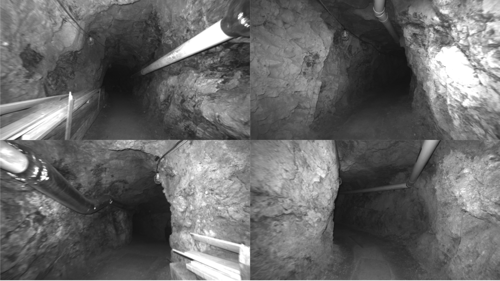
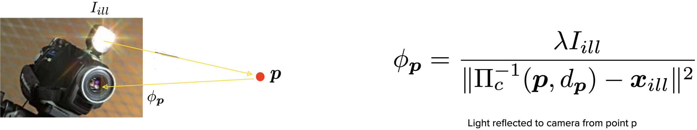
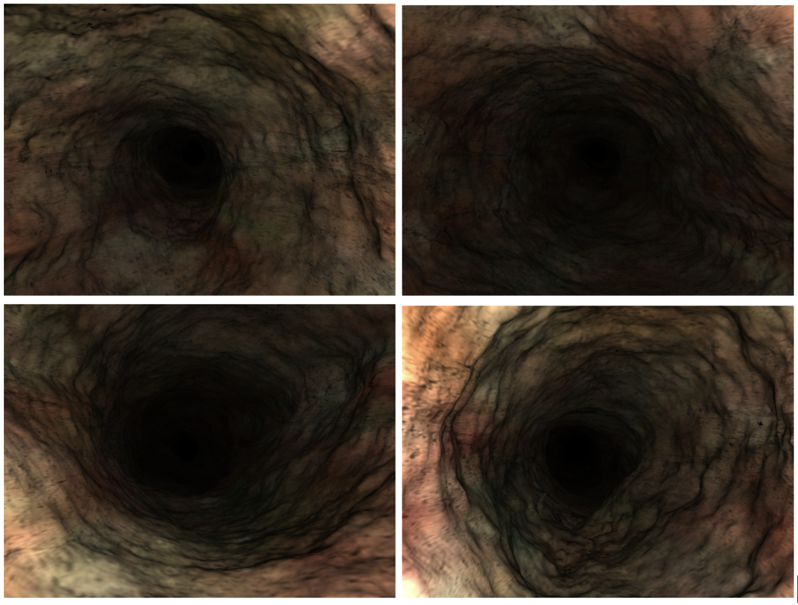

For my senior thesis at CU Boulder, I took on an interesting robotic perception project left behind from a graduated PhD student. The task was to integrate a lighting model into an existing direct SLAM codebase, so that robots operating with onboard lighting in dark environments could navigate visually.

|  |
|:--:|
| *This work aimed to improve monocular SLAM for low-light environments. Pictured are example frames from the [OIVIO](https://arpg.github.io/oivio/) dataset* |

In robotics, SLAM stands for Simultaneous Localization and Mapping, meaning that a robot has to both construct a representation of its environment and place itself in that representation, given its sensor data. Direct vision-based SLAM means that instead of tracking keypoints (salient features like corners and edges) between frames, the algorithm directly utilizes the illumination intensity of each pixel to estimate the movement between frames.

Because of this direct measurement, there is a strong lighting-constancy assumption in direct algorithms. Robots with onboard illumination violate this assumption by changing the lighting conditions of the scene as they move around. Given this information, the aim behind this project was to integrate a simple lighting model to utilize knowledge about the onboard illumination to decrease tracking error.

|  |
|:--:|
| *The simple lighting model used in the project, assuming a point light source* |

By integrating a lighting model into the algorithm, we were able to reduce tracking error substantially. However, the significance of these improvements was dubious due to the poor performance of the original algorithm. If you'd like to read more about the technical details, see the report linked above.

|  |
|:--:|
| *We used a simulated cave environment to test the changes to the algorithm* |

This was my first research project in robotics, and although there is a lot I would change if I were to do it again, I also learned a lot. I learned how to conduct a thorough literature review, I learned how to present ideas in a research context, and I learned how important it is to be able to communicate clearly where and how you could use assistance.
