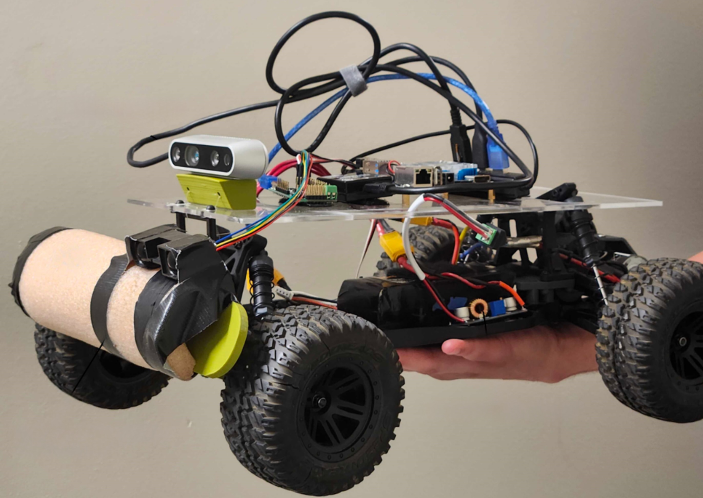

Advanced Robotics was the class I was looking forward to most in my time as an undergraduate at CU Boulder, and it did not disappoint. In addition to extremely interesting and varied lectures, we got to work concurrently on an autonomous racing project with the lab's hardware.

The main task for all teams was to build and program an autonomous vehicle that could navigate the race course in as little time as possible. There were also side-tasks that we could choose to tackle, and our team chose to stop when a stop sign was detected, and to estimate the tires' coefficient of friction in real time.

For control, we implemented a Stanley controller for lateral control, which uses both cross-track error and heading error to generate steering commands. For longitudinal control, we used a PID controller that adjusted speed based on upcoming turn curvature.

|  |
|:--:|
| *Our finished hardware (our team was mostly software engineers 🙃)* |

For stop sign detection, we trained a YOLO object detection model on images collected from our car's camera. The detector ran in real time and could reliably identify stop signs from various angles and under varying lighting conditions. When a stop sign was detected, our car would decelerate smoothly to a complete stop before the sign.

The project culminated in a final race where all teams competed for the fastest lap time. Our focus on robust control algorithms and adaptive behavior paid off — while our hardware wasn't the prettiest, our software was solid and our car completed consistent, competitive laps.

This project was an excellent introduction to autonomous mobile robotics, and gave me hands-on experience with the full pipeline from hardware to perception to control. It was fantastic to lead a multidisciplinary team and jump from task to task. It also showed me how challenging full-system integration can be on hardware with time constraints.
